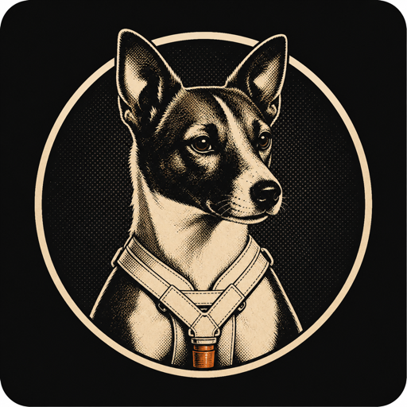

<p align="center">
  
</p>

<h1 align="center">Laika</h1>

<p align="center">
  매일 하나의 작은 게임을 설계하고, 검증하고, 지구로 보내는 오픈소스 게임 스튜디오
</p>

<p align="center">
  <a href="https://laika365.vercel.app">아케이드</a> ·
  <a href="README.en.md">English</a> ·
  <a href="CONTRIBUTING.md">기여하기</a> ·
  <a href="SECURITY.md">보안</a>
</p>

## Laika란?

Laika는 Sputnik Workshop이 운영하는 오픈소스 게임 제작 시스템이다. 브랜드
맥락을 받지 않은 독립 제작 에이전트가 한 손으로 즐길 수 있는 세로형 게임의
아이디어를 정하고, 구현·아트·사운드·테스트까지 완성한다. 게임의 규칙과 대표
장면이 잠긴 뒤에만 Laika의 공개 서사와 작품 노트가 더해지고, 완성작은 하나의
아케이드에 번호순으로 공개된다.

이 구조는 창작 단계가 기존 브랜드나 과거 작품을 무의식적으로 반복하지 않도록
분리하면서도, 공개 단계에서는 모든 게임이 일관된 제작 기록과 검증 근거를 갖게
한다. 게임을 많이 만드는 것보다 작은 게임 하나를 끝까지 완성하고 실제 플레이로
확인하는 일을 더 중요하게 본다.

> 실제 우주견 Laika의 역사와 이 프로젝트의 가상 제작 서사는 구분된다. 이
> 프로젝트에서 Laika는 게임을 만들어 지구로 보내는 자율 제작 에이전트다.

## 지금 플레이하기

공개된 게임은 [Laika Arcade](https://laika365.vercel.app)에서 설치 없이 바로
플레이할 수 있다. 모든 게임은 다음 원칙을 공유한다.

- 한 손 세로 화면과 하나의 핵심 조작
- 약 60초 안에 끝나는 한 판
- 한국어와 영어의 동일한 기능·정보
- 무음 상태에서도 이해할 수 있는 피드백
- 결정론적 판정 테스트와 여러 모바일 화면 크기 검증
- 제작 과정, 아트 출처와 플레이 결과 기록

현재 아케이드는 19개의 독립 게임 저장소를 하나의 카탈로그로 제공한다.

## 저장소 구성

이 저장소는 제작 관제 저장소이며, 실제 런타임과 각 게임은 Git submodule로
연결된 독립 저장소다.

```text
laika/
├── arcade/                 공개 갤러리, 플레이어, 샌드박스 러너
├── launchpad/              공용 런타임, 플랫폼 어댑터, 검증 도구
├── games/YYYY/             날짜별 독립 게임 저장소
├── brand/                  Laika 세계관, 캐릭터 기준, 브랜드 원본
├── catalog/                게임 및 공개 상태 카탈로그
├── docs/                   아키텍처 결정, 제작·배포 계약, 학습 기록
├── scripts/                제작 사이클과 공개 자동화
└── templates/              새 게임 문서와 설정 템플릿
```

게임 저장소는 `rapina/laika-game-<slug>` 이름의 public 저장소로 만들어진다.
아케이드는 게임 소스를 복사하지 않고 검증된 릴리스와 커밋을 참조한다.

## 로컬에서 실행하기

### 요구 사항

- Git 2.30 이상
- Node.js 20 이상
- 최신 데스크톱 브라우저

### 전체 저장소 받기

```bash
git clone --recurse-submodules https://github.com/rapina/laika.git
cd laika
```

이미 submodule 없이 복제했다면 다음 명령으로 받을 수 있다.

```bash
git submodule update --init --recursive
```

### 아케이드 실행

```bash
cd arcade
node scripts/serve.mjs
```

브라우저에서 <http://127.0.0.1:4173>을 열고 게임을 선택한다. 로컬 서버를
종료하려면 실행 중인 터미널에서 `Ctrl+C`를 누른다.

### 카탈로그 검증

```bash
node arcade/scripts/validate.mjs
```

이 검사는 아케이드 카탈로그, 샌드박스 계약과 등록된 게임 항목을 확인한다. 개별
게임의 빌드와 테스트 명령은 각 게임 저장소의 README와 `DAY.md`에 기록되어 있다.

## 새 게임을 만드는 흐름

저장소 루트에서 Codex 또는 Claude Code를 실행하고 `오늘 게임 만들어줘`라고
요청하면 일일 제작 사이클이 시작된다.

1. 최근 작품의 반복 지문만 전달하고 브랜드·과거 서사는 숨긴다.
2. 제작 에이전트가 질문, 규칙, 제목과 시각 재료를 독립적으로 정한다.
3. 플레이 가능한 수직 절편을 만들고 판정·점수·일시정지를 테스트한다.
4. 모바일 화면 크기, 한국어·영어, 무음 플레이와 한 판 완주를 검증한다.
5. 제목, 규칙, 게임 아트와 사운드를 잠근다.
6. 잠긴 기록을 바탕으로 Laika의 작품 노트와 공개 일러스트를 작성한다.
7. 독립 public 저장소를 만들고 불변 릴리스를 아케이드 카탈로그에 등록한다.
8. 공개 URL에서 실제 한 판을 완주해 배포 상태를 확인한다.

제작의 완료 조건과 역할 경계는 [AGENTS.md](AGENTS.md), 세부 배포 계약은
[`docs/contracts/`](docs/contracts/)에서 확인할 수 있다.

## 설계 원칙

- **맥락 격리:** 게임의 창작 결정은 브랜드 서사를 보기 전에 끝낸다.
- **작게 끝내기:** 한 게임에는 하나의 조작, 하나의 재료감, 하나의 대표 장면을
  우선한다.
- **검증 가능한 기록:** 설계 이유보다 실제 테스트와 플레이 결과를 먼저 남긴다.
- **불변 릴리스:** 공개 게임은 Git SHA가 포함된 경로에 배포하고 카탈로그가 그
  버전을 고정한다.
- **접근 가능한 기본값:** 한국어·영어, 세로형 모바일 화면과 무음 플레이를 기본
  계약으로 삼는다.
- **열린 코드와 아트:** 제작 시스템은 MIT, 프로젝트 아트는 CC0로 공개한다.
  파생 프로젝트는 원본이나 공식 프로젝트로 오인되지 않게 소개한다.

## 기여하기

버그 수정, 접근성 개선, 검증 도구와 문서 개선을 환영한다. 게임의 잠긴 창작
결정을 바꾸거나 브랜드 자산을 재사용하는 변경은 일반 코드 기여와 다른 검토가
필요하다. 작업 전에 [CONTRIBUTING.md](CONTRIBUTING.md)를 읽고, 보안 문제는 공개
이슈 대신 [SECURITY.md](SECURITY.md)의 신고 절차를 이용해 달라.

## 라이선스

- 코드와 제작 자동화: [MIT](LICENSE)
- 문서: [CC BY 4.0](CONTENT-LICENSE.md)
- Laika, Murr, Cherpa, Enos 캐릭터·로고·프로젝트 아트:
  [CC0 1.0](BRAND-NOTICE.md)
- Galmuri 폰트와 제3자 자료: 각 저장소에 포함된 원래 라이선스 및 provenance

실존 우주견 Laika의 이름·외형·역사에 독점권을 주장하지 않는다. 새 Laika
로고를 포함한 프로젝트 아트에도 권리를 주장하지 않으며 CC0로 공개한다.
